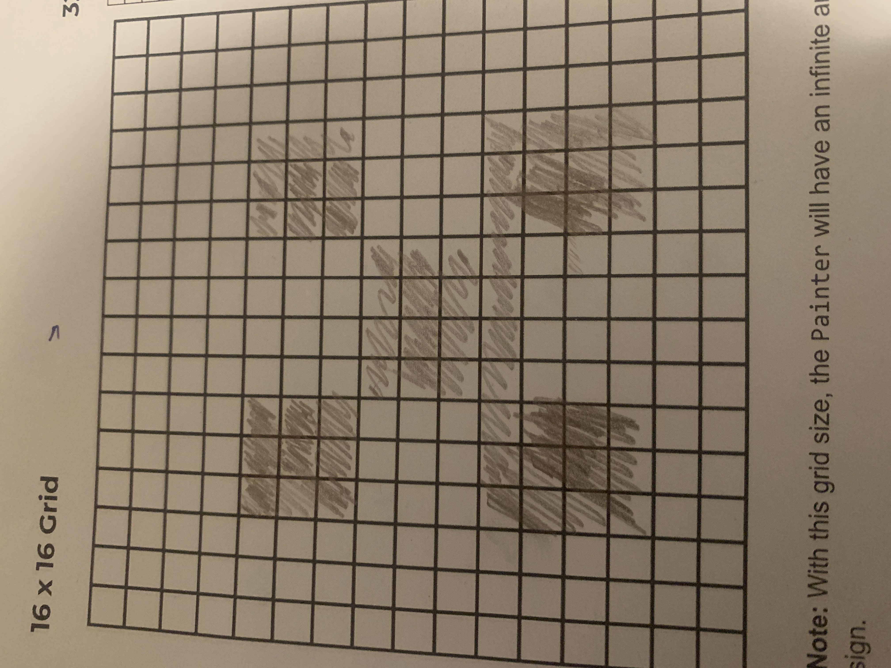

# Unit 1 - Asphalt Art

## Introduction

Cities use asphalt art to improve public safety, inspire their residents and visitors, and brighten communities. Your goal is to create asphalt art to revitalize The Neighborhood and bring the community together with the help of the Painter.

## Requirements

Use your knowledge of object-oriented programming, algorithms, the problem solving process, and decomposition strategies to create asphalt art:
- **Create a new subclass** – Create at least one new subclass of the PainterPlus class that is used for a component of the asphalt art design.
- **Plan an algorithm** – Use the problem solving process and decomposition strategies to plan an algorithm that incorporates a combination of sequencing, selection, and/or iteration.
- **Write a method** – Write at least one method in a PainterPlus subclass that contributes to a component of the asphalt art design.
- **Document your code** – Use comments to explain the purpose of the methods and code segments.

## Notes: Neighborhood & Painter Class

This project was created on Code.org's JavaLab platform using the built in Neightborhood GUI output. To test and edit this project you must build in Code.org's JavaLab with the Neighborhood GUI enabled. For reference to the Painter class documentation, [you can read more here.](https://studio.code.org/docs/ide/javalab/classes/Painter)

## Output:

## Reflection

1. Describe your project.

   - In my project I made a creeper face from Minecraft because it's a game I really enjoyed and the pixel art style is something reminded me of my childhood and so I decided on the creeper who has been my number 1 enemy.

2. What are two things about your project that you are proud of?

   - I'm really proud that I was able to create this all on my own, come out the way I wanted too, and I realised that I have learned another way too code.

3. Describe something you would improve or do differently if you had an opportunity to change something about your project.

   - I would go for the 32x32 and try and get help because I did 16x16 because I wasn't sure how to fix the code errors and would like the challenge for next time.